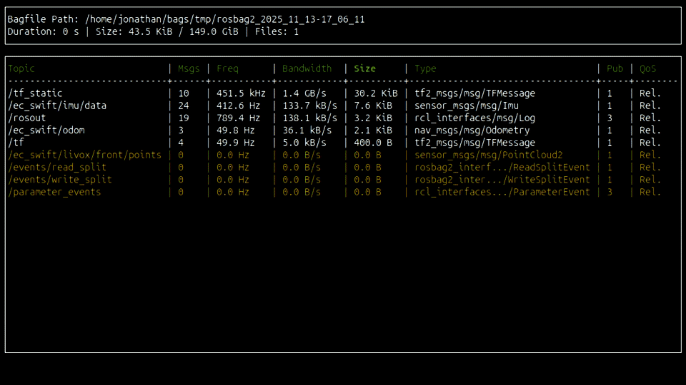

# hector_recorder




A terminal UI for recording ROS2 bags (strongly inspired by [rosbag_fancy](https://github.com/xqms/rosbag_fancy)).

Some of its features:
- Displays message count, topic type, frequency, bandwith, duration, disk size...
- Adaptive display based on terminal window size
- Same arguments as ```rosbag2``` ```(ros2 bag record)```
- Specify arguments per command line or YAML file
- Publishes status topic (optional)

If you are familiar with `ros2 bag record`, you can use `hector_recorder` as a drop-in replacement with additional convenience.

## Requirements

- ROS 2 (tested for jazzy)
- ncurses
- fmt
- yaml-cpp
```
sudo apt update &&
sudo apt install libncurses-dev libfmt-dev libyaml-cpp-dev
```

## Build

```bash
# clone this repo into your ros2 workspace, then build:
colcon build --packages-select hector_recorder hector_recorder_msgs
source install/setup.bash
```

## Usage
  ```bash
  bag_recorder <args>
  ```
Place all ROS arguments at the end of the command line.
  ```bash
  bag_recorder <args> --ros-args -r __ns:=my_namespace
  ```
We support almost all ```ros2 bag record``` arguments as explained in the [official documentation](https://github.com/ros2/rosbag2?tab=readme-ov-file#record).
In addition, there is:

    --max-bag-size-gb   Specify the split size in GB instead of bytes
    --publish-status    If true, recorder stats will be published on a topic
    --config            Load all parameters from a YAML file (see below for more details)

### Examples
- Record everything (all topics & services):  
  ```bash
  bag_recorder --all
  ```  

- Record specific topics:  
  ```bash
  bag_recorder --topics /tf /odom
  ```  

- Load from YAML:  
  ```bash
  bag_recorder --config /path/to/config.yaml
  ```

### Config file
All arguments can be specified either via command line or in a config file.

Example:
```yaml
node_name: "my_node_name"     # defaults to 'hector_recorder'
output: "/tmp/bags"           # will be normalized, timestamp subdir if directory
topics: 
 - "/tf" 
 - "/odom"
max_bag_duration: 60          # split the bag at 60s
publish_status: true          # publish hector_recorder_msgs status
```

See here for all available parameters and their default values:
[hector_recorder/config/default.yaml](hector_recorder/config/default.yaml)

### Directory resolution
- If ```--output/-o``` is not specified, a timestamped folder in the current directory is created.
- ```-o some_dir``` creates ```some_dir``` (works with absolute/relative paths)
- If you want to have timestamped bag files in a specified log dir (useful for automatic logging), you can append a slash:  
  ```-o some_dir/``` creates ```some_dir/rosbag_<stamp>```

### TODOs
- [ ] Add/test qos-profile-overrides-path


#### Acknowledgement
This project includes components from:
- ROS 2 [rosbag2](https://github.com/ros2/rosbag2)
- [CLI11](https://github.com/CLIUtils/CLI11) by Henry Schreiner (BSD-3-Clause)