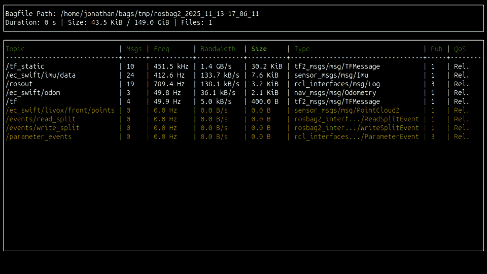

# hector_recorder



A terminal UI for recording ROS2 bags (strongly inspired by [rosbag_fancy](https://github.com/xqms/rosbag_fancy)).

Some of its features:
- Per-topic throttling by frequency or bandwidth (via config)
- Sort by message count, topic type, frequency, bandwith, duration, disk size...
- Adaptive display based on terminal window size
- Same arguments as ```rosbag2``` ```(ros2 bag record)```
- Colors indicate 'no msgs received' (yellow) and 'no publisher' (red)
- Specify arguments per command line or YAML file
- Publishes status topic (optional)
- **Remote control via ROS 2 services** (start, stop, pause, resume, split, apply config)
- **Headless mode** — no ncurses, controlled entirely via services
- **rqml plugin** — discover, monitor, and control multiple recorder instances from a Qt/QML GUI

If you are familiar with `ros2 bag record`, you can use `hector_recorder` as a drop-in replacement with additional convenience.

## Packages

| Package | Description |
|---------|-------------|
| `hector_recorder` | TUI recorder and headless recorder node |
| `hector_recorder_msgs` | Message and service definitions |
| `rqml_recorder` | rqml GUI plugin for remote control |

## Requirements

- ROS 2 (tested for jazzy)
- ncurses (TUI mode only)
- fmt
- yaml-cpp
```
sudo apt update &&
sudo apt install libncurses-dev libfmt-dev libyaml-cpp-dev
```

For the rqml plugin, you also need Qt6 and rqml:
```
sudo apt install qt6-base-dev qt6-declarative-dev
```

## Build

```bash
# clone this repo into your ros2 workspace, then build:
colcon build --packages-select hector_recorder_msgs hector_recorder rqml_recorder
source install/setup.bash
```

## Usage

### TUI Mode (default)

  ```bash
  bag_recorder <args>
  ```
Place all ROS arguments at the end of the command line.
  ```bash
  bag_recorder <args> --ros-args -r __ns:=my_namespace
  ```
We support almost all ```ros2 bag record``` arguments as explained in the [official documentation](https://github.com/ros2/rosbag2?tab=readme-ov-file#record).
In addition, there is:

    --max-bag-size-gb   Specify the split size in GB instead of bytes
    --publish-status    If true, recorder stats will be published on a topic
    --config            Load all parameters from a YAML file (see below for more details)

By pressing keys 1-8 you can sort the table by the respective column.

### Headless Mode

Run the recorder without ncurses, controlled entirely via ROS 2 services:

```bash
# Start idle (wait for StartRecording service call):
ros2 run hector_recorder record_headless --config /path/to/config.yaml

# Start recording immediately:
ros2 run hector_recorder record_headless --config /path/to/config.yaml --start-recording
```

### ROS 2 Services

Both the TUI and headless modes expose these services under the node namespace (`~/`):

| Service | Type | Description |
|---------|------|-------------|
| `~/start_recording` | `StartRecording` | Start a new recording (optional output_dir override) |
| `~/stop_recording` | `StopRecording` | Stop the current recording |
| `~/pause_recording` | `PauseRecording` | Pause recording |
| `~/resume_recording` | `ResumeRecording` | Resume after pause |
| `~/split_bag` | `SplitBag` | Split the current bag file |
| `~/apply_config` | `ApplyConfig` | Apply a new YAML config (optionally restart) |
| `~/save_config` | `SaveConfig` | Save a config YAML to a file on the recorder's filesystem |
| `~/get_available_topics` | `GetAvailableTopics` | List all topics on the ROS graph |

Example:
```bash
ros2 service call /hector_recorder/start_recording hector_recorder_msgs/srv/StartRecording "{output_dir: '/tmp/test_bag'}"
ros2 service call /hector_recorder/stop_recording hector_recorder_msgs/srv/StopRecording
```

### rqml Plugin

The `rqml_recorder` package provides a GUI plugin for [rqml](https://github.com/StefanFabian/rqml):

```bash
ros2 run rqml rqml
# Open Plugins > Recording > Recorder Manager
```

Features:
- Auto-discovers all running recorder instances
- Start/stop/pause/resume/split via buttons
- Live per-topic statistics table (sortable, color-coded)
- YAML config editor with interactive topic selector
- Preset management (save/load/delete configs as YAML files in `~/.ros/hector_recorder_presets/`)
- Send configs to recorders, optionally restarting the recording

### Examples
- Record everything (all topics & services):
  ```bash
  bag_recorder --all
  ```

- Record specific topics:
  ```bash
  bag_recorder --topics /tf /odom
  ```

- Load from YAML:
  ```bash
  bag_recorder --config /path/to/config.yaml
  ```

### Config file
All arguments can be specified either via command line or in a config file.

Example:
```yaml
node_name: "my_node_name"     # defaults to 'hector_recorder'
output: "/tmp/bags"           # will be normalized, timestamp subdir if directory
topics:
 - "/tf"
 - "/odom"
max_bag_duration: 60          # split the bag at 60s
publish_status: true          # publish hector_recorder_msgs status
topic_throttle:               # throttle a topic by rate or bandwidth
  "/tf":
    type: "messages"
    msgs_per_sec: 10.0
```

See here for all available parameters and their default values:
[hector_recorder/config/default.yaml](hector_recorder/config/default.yaml)

### Directory resolution
- If ```--output/-o``` is not specified, a timestamped folder in the current directory is created.
- ```-o some_dir``` creates ```some_dir``` (works with absolute/relative paths)
- If you want to have timestamped bag files in a specified log dir (useful for automatic logging), you can append a slash:
  ```-o some_dir/``` creates ```some_dir/rosbag_<stamp>```

#### Acknowledgement
This project includes components from:
- [rosbag2](https://github.com/ros2/rosbag2)
- [topic_tools](https://github.com/ros-tooling/topic_tools)
- [CLI11](https://github.com/CLIUtils/CLI11) by Henry Schreiner (BSD-3-Clause)
- [rqml] (https://github.com/StefanFabian/rqml)